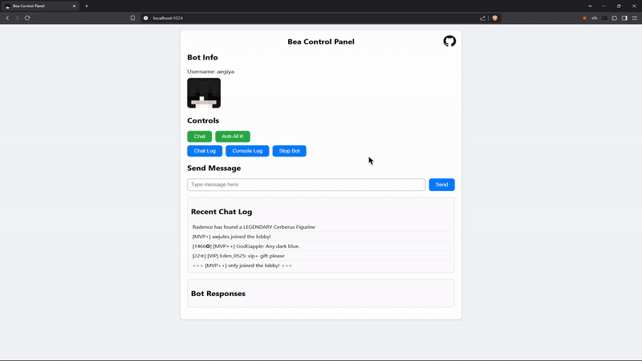
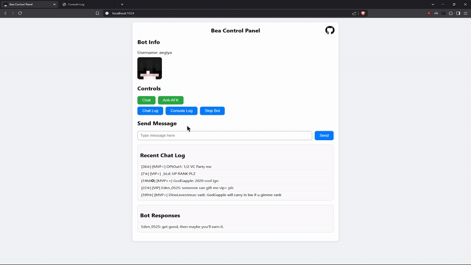
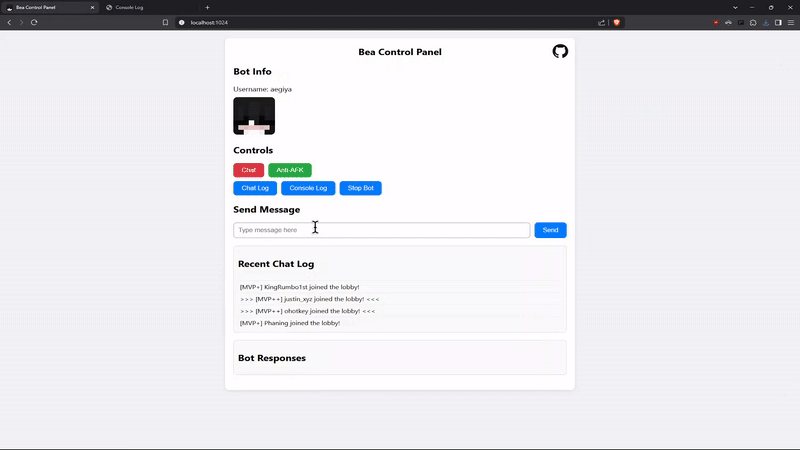
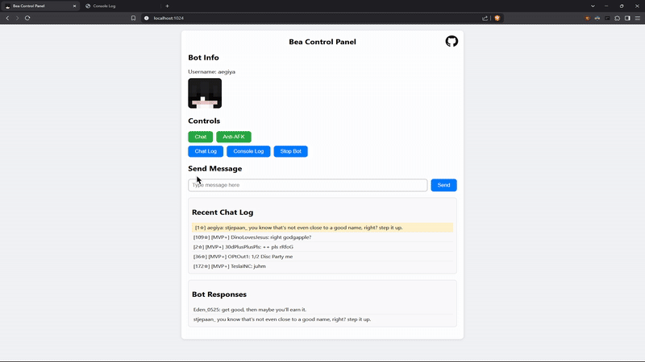

# bea

An advanced AI Minecraft chatbot and controller built with [Mineflayer](https://github.com/PrismarineJS/mineflayer), Node.js, and Socket.io. This project features a real-time web interface that lets you control your bot, view live chat logs, send messages, and monitor bot responses—all from your browser.

## Features

- **Real-Time Control:**  
  Toggle bot functionalities like Chat and Anti-AFK on/off through a modern, responsive control panel.

- **Live Chat Log:**  
  View a rotating log of recent chat messages (with in-game colors and formatting preserved) and open full chat and console logs in separate tabs.

- **Custom Bot Messaging:**  
  Send messages directly via the web interface for enhanced interaction.

- **Bot Responses:**  
  See the bot's responses (powered by a custom ChatWorker that integrates with the OpenAI API) in real time.

- **Advanced Logging:**  
  Chat and console logs are stored in dedicated log files (named with a Unix timestamp) and can be saved permanently if desired.

- **Prioritzation:**  
  Chats with the bots name in them are kept in a priority buffer and will be responded to rather than a random chat message.

- **Stop Bot Functionality:**  
  A secure two-step process to stop the bot: click “Stop Bot” once to confirm and click again to black out the interface and terminate the bot.


## Installation

1. **Clone the Repository:**

   ```bash
   git clone https://github.com/sawyershoemaker/bea
   cd bea
   ```
2. **Install Dependencies:**
   ```bash
   npm install
   ```
3. **Set Up API Key:**
   ```env
   OPENAI_API_KEY=your_openai_api_key;
   ```
4. **Run the Bot:**
   ```bash
   node main.js
   ```
## Project Structure
```bash
├── main.js               # Main bot code and connection to Minecraft server
├── chatWorker.js         # Worker thread for chat processing and OpenAI API calls
├── antiAfk.js            # Module to prevent bot AFK behavior
├── webserver.js          # Express server and Socket.io integration
├── .env                  # Environment variables (API key)
└── public/               # Static files for the web interface
    ├── index.html        # Main control panel UI
    ├── client.js         # Client-side JavaScript for real-time interactions
    ├── fullLog.html      # Full chat log view
    ├── fullLog.js        # Client-side code for full chat log view
    ├── consoleLog.html   # Full console log view
    ├── consoleLog.js     # Client-side code for console log view
    └── styles.css        # CSS styling for a modern interface
```

## Screencaps
### **Main Screen:**

### **Toggle Modules:**

### **Send Message:**

### **Save Log:**

### **Stop Bot:**


#### > Please open an issue if you have any problems! I am maintaining this project.
